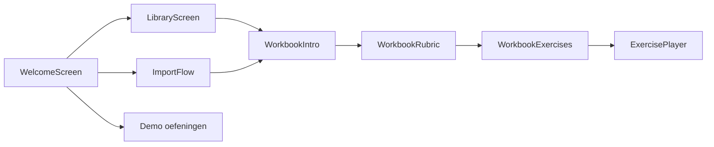
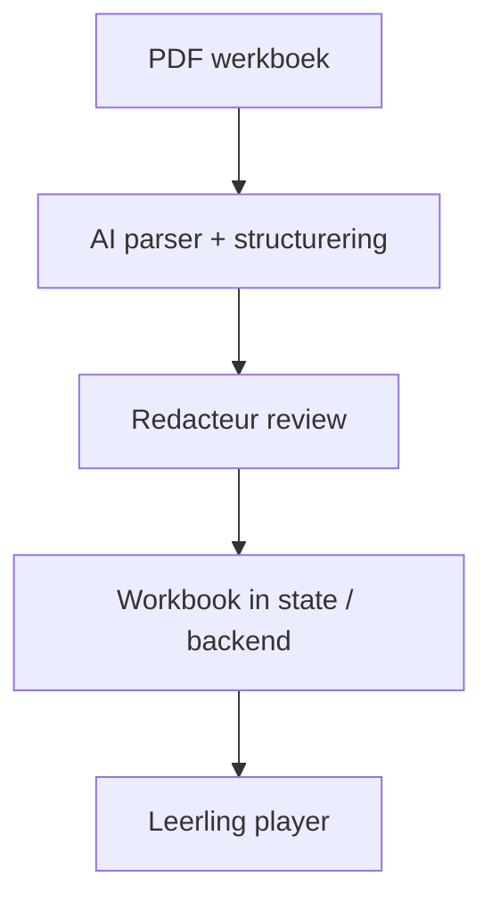

# Handover — Zwijsen PoC (frontend)

Korte gids voor de volgende iteratie van het team. Alles draait om **frontend userflow**; er is **geen API** en **geen database**. `LibraryProvider` gebruikt optioneel **`localStorage`** (`zwijsen.library.workbooks.v1`) — zie `TODO(handover)` in [`src/state/LibraryContext.tsx`](src/state/LibraryContext.tsx).

## Klantfeedback (sprint review) — nu vs later

**Nu verwerkt in productrichting en copy**

- **Leerling-focus:** standaardmodus bij openen is **Leerling**; redacteur is secundair (schakelaar rechtsboven).
- **Einddoel:** stand-alone webpagina voor leerlingen — beschreven in README en welkomstscherm (redacteur).
- **Import:** expliciet **begeleid / semi-automatisch** — geen belofte van volledig automatische, foutloze PDF-import; uitleg in import-header en navigatie-tooltips.
- **Data:** herleidbaarheid vraag / antwoord / brontekst benadrukt in docs en import-copy (sluit aan op `workbook` / `exercise` types).
- **Werkboek-flow:** intro → zelfevaluatie (rubric) → opdrachten → player.

**Later (bewust niet nu najagen)**

- Volledige automatische PDF-parser zonder menselijke stap.
- Grote visuele redesign op basis van **brand guide** (wacht op aanlevering).
- Backend + AI-pipeline (blijven als TODO hieronder).

## Snelstart

```bash
cd zwijsen-poc
npm install
npm run dev
```

- **Start (Leerling)**: welkomstscherm met drie interactieve demo-oefeningen (conceptkaart / swipe / raad & coach).
- **Start (Redacteur)**: zelfde app met CTA’s Bibliotheek + Importeren; uitleg leerling-product en begeleide import.
- **Bibliotheek**: voorbeeld-werkboek _Taaljacht — Groep 8 — Vloggen_ met **acht** opdrachten: drie met echte content, vijf placeholders voor het team.
- **Werkboek-flow**: intro → rubric (emoji-sliders) → opdrachtenkaarten → player.
- **Importeren**: 3-staps wizard; PDF wordt **niet** geparsed; opdrachten zijn **leeg** (geen dummy-inhoud). Kopie in de wizard benadrukt **semi-automatische** import en gestructureerde output.

## Architectuur (routes)

| View                  | Bestand / entry                                                                 |
| --------------------- | ------------------------------------------------------------------------------- |
| `welcome`             | [`WelcomeScreen.tsx`](src/components/shell/WelcomeScreen.tsx)                 |
| `library`             | [`LibraryScreen.tsx`](src/components/library/LibraryScreen.tsx)                 |
| `import`              | [`ImportFlow/index.tsx`](src/components/library/ImportFlow/index.tsx)           |
| `workbook-intro`      | [`WorkbookIntro.tsx`](src/components/library/WorkbookIntro.tsx)                 |
| `workbook-rubric`     | [`WorkbookRubric.tsx`](src/components/library/WorkbookRubric.tsx)               |
| `workbook-exercises`  | [`WorkbookExercises.tsx`](src/components/library/WorkbookExercises.tsx)         |
| `exercise`            | [`ExercisePlayer.tsx`](src/components/library/ExercisePlayer.tsx)               |
| `demo`                | [`AppShell.tsx`](src/components/shell/AppShell.tsx) → ConceptKaart / Swipe / RaadCoach |

Route-type en helpers: [`appView.ts`](src/components/shell/appView.ts) (`isWorkbookFlowView`, `workbookIdFromView`, …).



**Terug-navigatie:** in de werkboek-flow staat terug rechts van het logo ([`TopNav.tsx`](src/components/shell/TopNav.tsx)); vanuit de player terug naar opdrachten.

## Domeinmodellen

- **Werkboek / opdracht / brontekst**: [`src/types/workbook.ts`](src/types/workbook.ts)
  - `RubricGoal` + optioneel `Workbook.rubricGoals` — zelfevaluatie vóór opdrachten; leeg = rubricscherm overslaan.
  - `Exercise`: metadata (`pageNumber`, `type`, `difficulty`, `isPlus`, `isOwnAnswer`, `sourceTextId?`) + optioneel `content`.
  - `SourceText`: `kind`, `label`, optioneel `body`.
- **Content per oefening (discriminated union)**: [`src/types/exerciseContent.ts`](src/types/exerciseContent.ts)
- **Woorden / kaarten / relaties (gedeeld)**: [`src/types/content.ts`](src/types/content.ts)
- **Intro-brief (gedeeld)**: [`src/components/concepts/shared/types.ts`](src/components/concepts/shared/types.ts) — `ConceptBrief`

Digitale output van geïmporteerde werkboeken moet **herleidbaar** blijven in onderdelen zoals **vraag**, **antwoord** en **geclassificeerde brontekst** — het huidige model is daarop ingericht; verfijn mapping zodra er echte parse-output is.

Requirements uit `kennis/Requirements op basis van de analyses.pdf` zijn vertaald naar **vraagtypes** op `ExerciseType` + placeholders (geen UI voor de vijf nieuwe types).

## Stijl & UI-conventies

Gebruik de bestaande drie oefeningen als **visuele referentie**, niet als copy-paste van logica.

### Design tokens

- Hex en semantische kleuren: [`src/theme/zwijsenTokens.ts`](src/theme/zwijsenTokens.ts) (moet synchroon blijven met `src/index.css` `@theme`).
- Tailwind-classes: `text-text-primary`, `bg-surface-card`, `border-border-subtle`, `bg-brand-orange`, enz.

### Accenttonen per concept

[`src/data/concepts.ts`](src/data/concepts.ts) — `toneTokens`:

| Tone      | Gebruik (voorbeeld)     | Kleur      |
| --------- | ----------------------- | ---------- |
| `info`    | Conceptkaart, meerkeuze | blauw      |
| `warm`    | Swipe, tabel invullen    | oranje     |
| `success` | Raad & Coach, invullen  | groen      |
| `violet`  | Koppelen lijnen         | paars      |
| `amber`   | Markeren                | geel       |

In een nieuwe oefening: `const { accentColor, accentSoft } = toneTokens.<tone>;`

### Standaard schermopbouw

1. **Intro** — [`ConceptIntro`](src/components/concepts/shared/ConceptIntro.tsx): `brief` (`themeLabel`, `title`, `situation`, `question`, drie `steps`) + `stepConfig` (drie Lucide-icons) + `accentColor` / `accentBg` + knop “Ik begrijp het, start!”.
2. **Oefening** — [`ConceptHeader`](src/components/concepts/shared/ConceptHeader.tsx): compacte titel + help-popup met dezelfde stappen.
3. **Klaar** — patroon van [`SwipeKaarten/DonePanel.tsx`](src/components/concepts/SwipeKaarten/DonePanel.tsx) of [`RaadCoach/DonePanel.tsx`](src/components/concepts/RaadCoach/DonePanel.tsx): korte samenvatting + optioneel “nog een keer”.

### Typografie & knoppen

- Koppen: `font-black`, `text-text-primary`.
- Secundair: `text-text-secondary` / `text-text-muted`.
- Primaire CTA: `bg-brand-orange`, `rounded-2xl`, `font-black`, `text-white`.
- Kaarten: `rounded-3xl`, `border-border-subtle`, `shadow-[var(--shadow-card)]`.
- Layout in player: `flex h-full min-h-0 flex-col overflow-hidden` (voorkomt dubbele scroll).

### Referentie-implementaties

| Oefening      | Map                                              | Content-type          |
| ------------- | ------------------------------------------------ | --------------------- |
| Conceptkaart  | [`ConceptKaart/`](src/components/concepts/ConceptKaart/) | `ConceptKaartContent` |
| Swipe-kaarten | [`SwipeKaarten/`](src/components/concepts/SwipeKaarten/) | `SwipeKaartenContent` |
| Raad & Coach  | [`RaadCoach/`](src/components/concepts/RaadCoach/)       | `RaadCoachContent`    |

Semantische validatie conceptkaart: [`validateConnection.ts`](src/components/concepts/ConceptKaart/validateConnection.ts).

## Recept: nieuwe interactieve oefening bouwen

1. **Map aanmaken:** `src/components/concepts/<TypeNaam>/` met minimaal `index.tsx` en `examples.ts` (spiegel ConceptKaart / SwipeKaarten / RaadCoach).
2. **Types:** vervang de placeholder in [`exerciseContent.ts`](src/types/exerciseContent.ts) door een volledige interface (zoals `ConceptKaartContent`). Type staat al op `ExerciseType` in [`workbook.ts`](src/types/workbook.ts).
3. **Vloggen-voorbeeld:** in `examples.ts` — `ConceptBrief` + data + geëxporteerde `*Content` (zie secties hieronder).
4. **Seed:** in [`seedWorkbook.ts`](src/library/seedWorkbook.ts) bij de betreffende opdracht `content: vloggen*Content` zetten.
5. **Player:** case toevoegen in [`ExercisePlayer.tsx`](src/components/library/ExercisePlayer.tsx) (`switch (c.type)`).
6. **Import-wizard:** type staat al in [`PreviewStep.tsx`](src/components/library/ImportFlow/PreviewStep.tsx) (`TYPES`-array).
7. **Placeholder:** zodra de UI werkt, valt de opdracht niet meer onder `TypePlaceholder` in de `default`-tak.

**Checklist per oefening**

- [ ] `ConceptIntro` + `ConceptHeader` (of bewuste afwijking documenteren)
- [ ] Accenttoon uit `toneTokens`
- [ ] `brief.themeLabel` consistent: `Groep 8 · Taal · Thema: Vloggen`
- [ ] Brontekst via `Exercise.sourceTextId` + `Workbook.sources` indien nodig
- [ ] Scoring/feedback (direct vs na “controleren”)
- [ ] Leeg-staat niet nodig als `content` verplicht is; anders `EmptyExerciseContent` in player
- [ ] Mobiel: geen horizontale scroll; touch-targets ≥ 44px
- [ ] Screenshot in PR

**Teamafspraak:** wijs **één eigenaar per opdrachttype** toe vóór je start — voorkomt merge-conflicten op `ExercisePlayer.tsx` en `exerciseContent.ts`.

## AI-importflow (workflow-spec, geen implementatie)

De technische AI-koppeling wordt door het team elders uitgewerkt. In deze repo is alleen de **landing zone** voor gestructureerde data.

### Beoogde flow



1. **Input:** PDF (leskant / taakboekje) + metadata (groep, titel, kant).
2. **AI-output (voorstel):** JSON die past op `Workbook` — `exercises[]` met `type`, `pageNumber`, `difficulty`, … en waar mogelijk al `ExerciseContent` + `sources[]` met `body`.
3. **Review:** redacteur corrigeert in UI (nu: import-wizard [`ImportFlow/`](src/components/library/ImportFlow/); later: dedicated review of editor).
4. **Opslag:** `addWorkbook` / `updateExercise` in [`LibraryContext.tsx`](src/state/LibraryContext.tsx) (nu localStorage; later API).
5. **Leerling:** zelfde player als voorbeeld-werkboek.

### Waar in de code

| Stap              | Huidige plek                                                                 |
| ----------------- | ---------------------------------------------------------------------------- |
| Handmatige import | [`ImportFlow/`](src/components/library/ImportFlow/) — 3 stappen, geen parser |
| Variant per opdracht | [`AIGenerateDialog.tsx`](src/components/library/AIGenerateDialog.tsx) — UI only |
| Persistentie      | `LibraryContext` + `localStorage` key `zwijsen.library.workbooks.v1`         |

### Grenzen

- **Geen API-keys in de frontend** — AI-calls via backend of serverless.
- Geïmporteerde opdrachten zonder `content` tonen [`EmptyExerciseContent`](src/components/concepts/placeholders/TypePlaceholder.tsx); met alleen `type` tonen ze `TypePlaceholder` tot de UI bestaat.
- `mergeStoredWorkbooks` in `LibraryContext` vult het voorbeeld-werkboek aan bij oude localStorage (rubric + ontbrekende seed-opdrachten).

## Vijf nieuwe opdrachttypes — specs

In het Vloggen-werkboek staan al **placeholder-opdrachten** per type met skeleton-`content` (`{ type: "meerkeuze" }`, enz.) — open ze in leerlingmodus om `TypePlaceholder` te zien (spec + Definition of done). Jullie taak: echte UI + `examples.ts` + volledige types + seed koppelen.

Woordenset Vloggen (hergebruik waar mogelijk): recensie, beoordeling, spectaculair, opzienbarend, lyrisch, afstandelijk, compositie, beeld — zie [`ConceptKaart/examples.ts`](src/components/concepts/ConceptKaart/examples.ts).

---

### Opdrachttype: meerkeuze

**Didactisch doel**  
Standaardvraagtype in alle groepen: één duidelijke vraag, meerdere opties, één of meerdere juiste antwoorden. Lage drempel, geschikt voor feitenkennis en woordbetekenis in context.

**Voorgesteld datacontract** (_voorstel — pas aan na teamafspraak_)

```ts
export interface MeerkeuzeContent {
  type: "meerkeuze";
  brief: ConceptBrief;
  question: string;
  options: { id: string; label: string }[];
  correctOptionIds: string[];
  allowMultiple: boolean;
  explanation?: string;
  sourceTextId?: string;
}
```

**Vloggen-voorbeeld (JSON)**

```json
{
  "type": "meerkeuze",
  "brief": {
    "themeLabel": "Groep 8 · Taal · Thema: Vloggen",
    "title": "Wat is een recensie?",
    "situation": "Je bereidt je vlog voor en wilt het juiste woord gebruiken.",
    "question": "Welke zin beschrijft een recensie het best?",
    "steps": ["Lees de vraag.", "Kies één antwoord.", "Bekijk de uitleg."]
  },
  "question": "Wat is een recensie?",
  "options": [
    { "id": "a", "label": "Een korte reactie zonder argumenten" },
    { "id": "b", "label": "Tekst of video waarin je iets beoordeelt met argumenten" },
    { "id": "c", "label": "Alleen een cijfer op een schaal" }
  ],
  "correctOptionIds": ["b"],
  "allowMultiple": false,
  "explanation": "Een recensie bevat je mening én onderbouwing — niet alleen een cijfer."
}
```

**UI-conventies**  
Toon `info`. `ConceptIntro` + `ConceptHeader`. Opties als grote klikbare kaarten of checkboxes/radio’s. Feedback na “Controleren”: groen/rood met `explanation`. CTA-oranje voor controleren.

**Edge cases**  
`allowMultiple` vs UI (checkbox vs radio). Plusopdracht: moeilijkere distractors. Brontekst tonen als `sourceTextId` gezet is.

**Definition of done**  
Types, `Meerkeuze/examples.ts`, seed `ex-example-meerkeuze`, player-case, mobiel getest, screenshot in PR.

---

### Opdrachttype: koppelen-lijnen

**Didactisch doel**  
Links en rechts horen bij elkaar; leerling trekt lijnen. **Niet** de semantische conceptkaart (die heeft relatietypes en canvas) — dit is generiek koppel-item (woord ↔ definitie, vraag ↔ antwoord).

**Voorgesteld datacontract**

```ts
export interface KoppelenLijnenContent {
  type: "koppelen-lijnen";
  brief: ConceptBrief;
  leftItems: { id: string; label: string }[];
  rightItems: { id: string; label: string }[];
  correctPairs: { leftId: string; rightId: string }[];
  sourceTextId?: string;
}
```

**Vloggen-voorbeeld (JSON)**

```json
{
  "type": "koppelen-lijnen",
  "brief": {
    "themeLabel": "Groep 8 · Taal · Thema: Vloggen",
    "title": "Koppel het woord aan de betekenis",
    "situation": "Voor je vlog moet je de woorden goed kunnen uitleggen.",
    "question": "Trek lijnen tussen woord en definitie.",
    "steps": ["Tik links, dan rechts.", "Of sleep een lijn.", "Controleer je koppels."]
  },
  "leftItems": [
    { "id": "l1", "label": "spectaculair" },
    { "id": "l2", "label": "afstandelijk" }
  ],
  "rightItems": [
    { "id": "r1", "label": "heel indrukwekkend" },
    { "id": "r2", "label": "koel, weinig emotie" }
  ],
  "correctPairs": [
    { "leftId": "l1", "rightId": "r1" },
    { "leftId": "l2", "rightId": "r2" }
  ]
}
```

**UI-conventies**  
Toon `violet`. Twee kolommen; SVG of canvas voor lijnen (vergelijk niet 1-op-1 met `@xyflow` conceptkaart tenzij bewust). Shuffle rechterkolom in UI.

**Edge cases**  
Meerdere lijnen per item? 1-op-1 afdwingen. Touch op tablet. Visuele feedback per lijn (goed/fout).

**Definition of done**  
Types, componentmap, examples, seed `ex-example-koppelen`, player-case, screenshot.

---

### Opdrachttype: invullen-zin

**Didactisch doel**  
Woord of woordgroep in een zin plaatsen — vaak met brontekst op andere pagina. Sluit aan bij contextueel woordgebruik (zoals swipe, maar met typen/kiezen uit bank).

**Voorgesteld datacontract**

```ts
export interface InvullenZinContent {
  type: "invullen-zin";
  brief: ConceptBrief;
  template: string;
  blanks: {
    id: string;
    correctAnswers: string[];
    caseSensitive?: boolean;
    wordBank?: string[];
  }[];
  sourceTextId?: string;
}
```

`template` gebruikt placeholders zoals `{{blank-1}}` of `___` — kies één conventie en documenteer in de component.

**Vloggen-voorbeeld (JSON)**

```json
{
  "type": "invullen-zin",
  "brief": {
    "themeLabel": "Groep 8 · Taal · Thema: Vloggen",
    "title": "Vul het woord in de zin in",
    "situation": "Je schrijft de voice-over voor je vlog.",
    "question": "Welk woord past in het gat?",
    "steps": ["Lees de zin.", "Kies of typ het woord.", "Controleer."]
  },
  "template": "De finale van gisteren was echt {{blank-1}}!",
  "blanks": [
    {
      "id": "blank-1",
      "correctAnswers": ["spectaculair"],
      "wordBank": ["afstandelijk", "spectaculair", "lyrisch"]
    }
  ],
  "sourceTextId": "src-vloggen-intro"
}
```

**UI-conventies**  
Toon `success`. Brontekst-panel boven de zin indien `sourceTextId`. Dropdown of woordbank-chips.

**Edge cases**  
Synoniemen in `correctAnswers`. Hoofdlettergevoeligheid. Meerdere blanks in één zin.

**Definition of done**  
Types, examples, seed `ex-example-invullen-zin`, brontekst in seed, player-case.

---

### Opdrachttype: markeren

**Didactisch doel**  
In een doorlopende tekst woorden of zinsdelen markeren (kleur/highlight) — vaak verwijzing naar eerdere pagina of brontekst. Train herkenning (bijv. oordeelswoorden, tegenstellingen).

**Voorgesteld datacontract**

```ts
export interface MarkerenContent {
  type: "markeren";
  brief: ConceptBrief;
  instruction: string;
  text: string;
  correctSpans: { start: number; end: number }[];
  maxSelections?: number;
  sourceTextId?: string;
}
```

`start`/`end` zijn character-indexen in `text` (UTF-16 zoals JavaScript strings).

**Vloggen-voorbeeld (JSON)**

```json
{
  "type": "markeren",
  "brief": {
    "themeLabel": "Groep 8 · Taal · Thema: Vloggen",
    "title": "Markeer de oordeelswoorden",
    "situation": "In je recensie gebruik je woorden die je mening laten zien.",
    "question": "Markeer alle woorden die een oordeel uitdrukken.",
    "steps": ["Lees de tekst.", "Tik op een woord om te markeren.", "Druk op Controleren."]
  },
  "instruction": "Markeer de oordeelswoorden in de zin.",
  "text": "In mijn recensie geef ik een duidelijke beoordeling van de nieuwe game.",
  "correctSpans": [
    { "start": 7, "end": 15 },
    { "start": 33, "end": 44 }
  ],
  "sourceTextId": "src-vloggen-intro"
}
```

**UI-conventies**  
Toon `amber`. Selecteerbare woord-spans (split op spaties) of tekst-selectie. Duidelijke geselecteerde staat (achtergrond `accentAmberSoft`).

**Edge cases**  
Overlappende spans. Woorden met leestekens. “Te veel gemarkeerd”-feedback.

**Definition of done**  
Types, examples, seed `ex-example-markeren`, player-case, indexen getest.

---

### Opdrachttype: tabel-invullen

**Didactisch doel**  
Invulvelden in een rij/kolomstructuur — typisch voor vergelijken, plannen (vlogplan), of eigenschappen invullen.

**Voorgesteld datacontract**

```ts
export interface TabelInvullenContent {
  type: "tabel-invullen";
  brief: ConceptBrief;
  columns: { id: string; header: string }[];
  rows: {
    id: string;
    cells: {
      columnId: string;
      editable: boolean;
      value?: string;
      correctAnswers?: string[];
    }[];
  }[];
  sourceTextId?: string;
}
```

Niet-bewerkbare cellen tonen vaste `value`; bewerkbare cellen valideren tegen `correctAnswers`.

**Vloggen-voorbeeld (JSON)**

```json
{
  "type": "tabel-invullen",
  "brief": {
    "themeLabel": "Groep 8 · Taal · Thema: Vloggen",
    "title": "Maak je vlogplan",
    "situation": "Een goed plan helpt je vlog strak te presenteren.",
    "question": "Vul de tabel in.",
    "steps": ["Lees de koppen.", "Vul de lege vakjes in.", "Controleer."]
  },
  "columns": [
    { "id": "onderdeel", "header": "Onderdeel" },
    { "id": "invulling", "header": "Jouw plan" }
  ],
  "rows": [
    {
      "id": "row-1",
      "cells": [
        { "columnId": "onderdeel", "editable": false, "value": "Onderwerp" },
        {
          "columnId": "invulling",
          "editable": true,
          "correctAnswers": ["recensie", "game", "film"]
        }
      ]
    },
    {
      "id": "row-2",
      "cells": [
        { "columnId": "onderdeel", "editable": false, "value": "Toon" },
        {
          "columnId": "invulling",
          "editable": true,
          "correctAnswers": ["lyrisch", "afstandelijk", "enthousiast"]
        }
      ]
    }
  ]
}
```

**UI-conventies**  
Toon `warm`. Responsive tabel: op smalle schermen kaarten per rij i.p.v. smalle kolommen. Inputs `rounded-xl`, `border-border-subtle`.

**Edge cases**  
Creatieve antwoorden: `correctAnswers` vs vrije validatie (eigen antwoord-flag op `Exercise`). Lege cellen vs optioneel.

**Definition of done**  
Types, examples, seed `ex-example-tabel`, player-case, mobiele layout.

---

## TODO-checklist (volgende stappen)

### AI-import

- [ ] Koppel AI-parser aan import-flow (output → `Workbook` / `Exercise.content`).
- [ ] Reviewstap voor redacteur na AI (geen 100% hands-off).
- [ ] `AIGenerateDialog`: endpoint + prompt + review; geen secrets in frontend.
- [ ] Variant genereren → `updateExercise` met gevulde `content`.

### Persistentie

- [ ] Vervang `localStorage` door backend (bv. Supabase) — zie TODO in `LibraryContext`.

### Nieuwe opdrachten (team)

- [ ] **meerkeuze** — eigenaar: _…_
- [ ] **koppelen-lijnen** — eigenaar: _…_
- [ ] **invullen-zin** — eigenaar: _…_
- [ ] **markeren** — eigenaar: _…_
- [ ] **tabel-invullen** — eigenaar: _…_

Placeholders tot UI klaar is: [`TypePlaceholder.tsx`](src/components/concepts/placeholders/TypePlaceholder.tsx).

### Overige

- [ ] PDF-upload + parser → `Exercise.content` + `SourceText.body`.
- [ ] Brontekst altijd meesturen waar de opdracht het vereist.
- [ ] UI leskant vs taakboekje (`BookSide`).
- [ ] Niveau a/b/c filter in bibliotheek.
- [ ] Plusopdrachten en `isOwnAnswer` — flow in player/editor.
- [ ] Afbeeldingen: decoratie vs informatief.
- [ ] Types nog niet toegewezen: `open-schrijven`, `volgorde-nummeren`, `rubric` (content-type; werkboek-rubric is apart).

## Belangrijke bestanden

| Onderdeel           | Pad |
| ------------------- | --- |
| App + routes        | `src/components/shell/AppShell.tsx` |
| View-types          | `src/components/shell/appView.ts` |
| Topnav              | `src/components/shell/TopNav.tsx` |
| Werkboek intro      | `src/components/library/WorkbookIntro.tsx` |
| Werkboek rubric     | `src/components/library/WorkbookRubric.tsx` |
| Werkboek opdrachten | `src/components/library/WorkbookExercises.tsx` |
| Emoji-rubric        | `src/components/library/EmojiRubric.tsx` |
| Player              | `src/components/library/ExercisePlayer.tsx` |
| Placeholders        | `src/components/concepts/placeholders/TypePlaceholder.tsx` |
| Library state       | `src/state/LibraryContext.tsx` |
| Seed voorbeeld      | `src/library/seedWorkbook.ts` |
| Design tokens       | `src/theme/zwijsenTokens.ts` |
| Concept-tonen       | `src/data/concepts.ts` |
| Gedeelde intro      | `src/components/concepts/shared/ConceptIntro.tsx` |

---

Vragen? Houd deze file bij elke grote wijziging synchroon met de code (`TODO(handover)` in repo zoeken).
