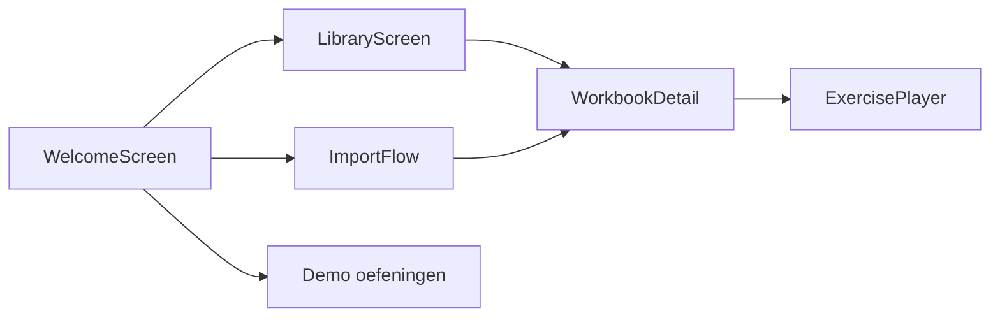

# Handover — Zwijsen PoC (frontend)

Korte gids voor de volgende iteratie van het team. Alles draait om **frontend userflow**; er is **geen API** en **geen database**. `LibraryProvider` gebruikt optioneel **`localStorage`** (`zwijsen.library.workbooks.v1`) — zie `TODO(handover)` in [`src/state/LibraryContext.tsx`](src/state/LibraryContext.tsx).

## Klantfeedback (sprint review) — nu vs later

**Nu verwerkt in productrichting en copy**

- **Leerling-focus:** standaardmodus bij openen is **Leerling**; redacteur is secundair (schakelaar rechtsboven).
- **Einddoel:** stand-alone webpagina voor leerlingen — beschreven in README en welkomstscherm (redacteur).
- **Import:** expliciet **begeleid / semi-automatisch** — geen belofte van volledig automatische, foutloze PDF-import; uitleg in import-header en navigatie-tooltips.
- **Data:** herleidbaarheid vraag / antwoord / brontekst benadrukt in docs en import-copy (sluit aan op `workbook` / `exercise` types).

**Later (bewust niet nu najagen)**

- Volledige automatische PDF-parser zonder menselijke stap.
- Grote visuele redesign op basis van **brand guide** (wacht op aanlevering).
- Backend + AI-pipeline (blijven als TODO hieronder).

## Snelstart

```bash
cd zwijsen-poc
npm install
npm run dev
```

- **Start (Leerling)**: welkomstscherm met drie interactieve demo-oefeningen (conceptkaart / swipe / raad & coach).
- **Start (Redacteur)**: zelfde app met CTA’s Bibliotheek + Importeren; uitleg leerling-product en begeleide import.
- **Bibliotheek**: voorbeeld-werkboek *Taaljacht — Groep 8 — Vloggen* met drie opdrachten die echte content hebben.
- **Importeren**: 3-staps wizard; PDF wordt **niet** geparsed; opdrachten zijn **leeg** (geen dummy-inhoud). Kopie in de wizard benadrukt **semi-automatische** import en gestructureerde output.

## Architectuur (routes)

| View        | Bestand / entry                         |
|------------|------------------------------------------|
| `welcome`  | [`WelcomeScreen.tsx`](src/components/shell/WelcomeScreen.tsx) |
| `library`  | [`LibraryScreen.tsx`](src/components/library/LibraryScreen.tsx) |
| `import`   | [`ImportFlow/index.tsx`](src/components/library/ImportFlow/index.tsx) |
| `workbook` | [`WorkbookDetail.tsx`](src/components/library/WorkbookDetail.tsx) |
| `exercise` | [`ExercisePlayer.tsx`](src/components/library/ExercisePlayer.tsx) |
| `demo`     | [`AppShell.tsx`](src/components/shell/AppShell.tsx) → ConceptKaart / SwipeKaarten / RaadCoach |

Route-type: [`appView.ts`](src/components/shell/appView.ts).



## Domeinmodellen

- **Werkboek / opdracht / brontekst**: [`src/types/workbook.ts`](src/types/workbook.ts)
- **Content per oefening (discriminated union)**: [`src/types/exerciseContent.ts`](src/types/exerciseContent.ts)
- **Woorden / kaarten / relaties (gedeeld)**: [`src/types/content.ts`](src/types/content.ts)

Digitale output van geïmporteerde werkboeken moet **herleidbaar** blijven in onderdelen zoals **vraag**, **antwoord** en **geclassificeerde brontekst** — het huidige model is daarop ingericht (`Exercise`, `SourceText`, `ExerciseContent`); verfijn mapping zodra er echte parse-output is.

Requirements uit `kennis/Requirements op basis van de analyses.pdf` zijn vertaald naar **vraagtypes** op `ExerciseType` + placeholders (geen implementatie).

## Generieke oefeningen (recept)

De drie uitgewerkte oefeningen accepteren **optionele content-props**; default = Vloggen-voorbeeld in `examples.ts`:

| Oefening       | Voorbeelddata                         | Prop-type              |
|----------------|---------------------------------------|------------------------|
| Conceptkaart   | [`ConceptKaart/examples.ts`](src/components/concepts/ConceptKaart/examples.ts) | `ConceptKaartContent`  |
| Swipe-kaarten  | [`SwipeKaarten/examples.ts`](src/components/concepts/SwipeKaarten/examples.ts) | `SwipeKaartenContent` |
| Raad & Coach   | [`RaadCoach/examples.ts`](src/components/concepts/RaadCoach/examples.ts) | `RaadCoachContent`     |

**Nieuwe oefening toevoegen:**

1. Breid `ExerciseContent` in [`exerciseContent.ts`](src/types/exerciseContent.ts) uit met een nieuwe `{ type: "..." }`-variant.
2. Voeg het type toe aan `ExerciseType` in [`workbook.ts`](src/types/workbook.ts).
3. Registreer rendering in [`ExercisePlayer.tsx`](src/components/library/ExercisePlayer.tsx) (`switch (c.type)`).
4. Voeg eventueel een blok toe in [`TypePlaceholder.tsx`](src/components/concepts/placeholders/TypePlaceholder.tsx) voor documentatie totdat de UI bestaat.
5. Zet in de import-wizard het type in [`PreviewStep.tsx`](src/components/library/ImportFlow/PreviewStep.tsx) (`TYPES`-array).

**Semantische validatie conceptkaart:** [`validateConnection.ts`](src/components/concepts/ConceptKaart/validateConnection.ts) — krijgt `pairs` mee vanuit props / `SemanticCanvas`.

## TODO-checklist (volgende stappen)

### PDF / import

- [ ] Houd import **begeleid**: parser + **reviewstap** voor redacteur (geen doel van 100% hands-off automatisering — werkboeken zijn visueel complex).
- [ ] Echte PDF-upload + parser → vul `Exercise.content` en `SourceText.body`.
- [ ] Brontekst **altijd meesturen** met opdracht (zie requirements-PDF).
- [ ] Twee boekdelen: `leskant` vs `taakboekje` al in model; UI voor scheiding uitbreiden.

### AI

- [ ] `AIGenerateDialog`: endpoint + prompt + review-stap; geen secrets in frontend.
- [ ] Variant genereren → schrijf terug naar `Exercise.content` via `updateExercise`.

### Persistentie

- [ ] Vervang `localStorage` door backend (bv. Supabase) — zie TODO in `LibraryContext`.

### Vraagtypes (placeholders)

Zie [`TypePlaceholder.tsx`](src/components/concepts/placeholders/TypePlaceholder.tsx): meerkeuze, koppelen-lijnen, invullen-zin, open schrijven, markeren, tabel, volgorde, rubric.

### Overige requirements

- [ ] Niveau a/b/c filter in bibliotheek.
- [ ] Plusopdrachten en `isOwnAnswer` al in model — UI/flow verder uitwerken.
- [ ] Afbeeldingen / decoratie vs informatief (per opdracht).

## Belangrijke bestanden

| Onderdeel        | Pad |
|------------------|-----|
| App + routes     | `src/components/shell/AppShell.tsx` |
| Topnav           | `src/components/shell/TopNav.tsx` |
| Library state    | `src/state/LibraryContext.tsx` |
| Seed voorbeeld   | `src/library/seedWorkbook.ts` |
| Id’s             | `src/library/id.ts` |

---

Vragen? Houd deze file bij elke grote wijziging synchroon met de code (`TODO(handover)` in repo zoeken).
